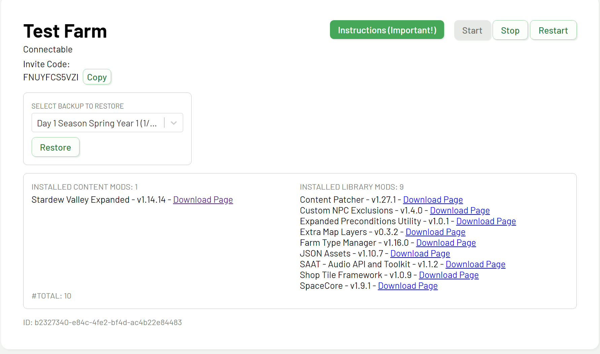

# How do I restart my Stardew server?

The best place to start when troubleshooting issues with your server is to restart the server. This can be accomplished by following the below steps.

## Steps

1. Go to [junimohost.com/dashboard](https://junimohost.com/dashboard).

:::note

If you're not already signed in, it will redirect you to log in first.

:::

2. Locate the **Restart** button in the top right, to the right of the green Instructions button.

3. Click the **Restart** button and wait for the server to restart.

:::warning

If restarting takes more than 10 minutes, contact us using one of the methods found [here](contact-us).

:::
